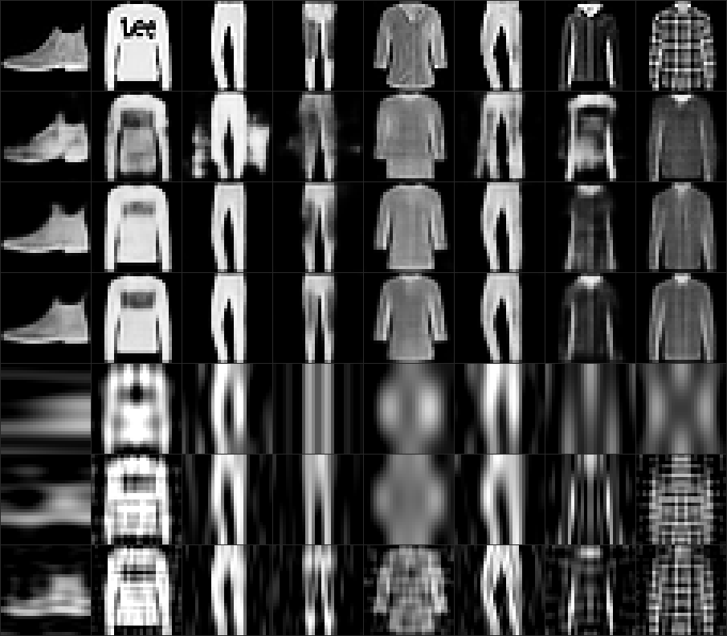
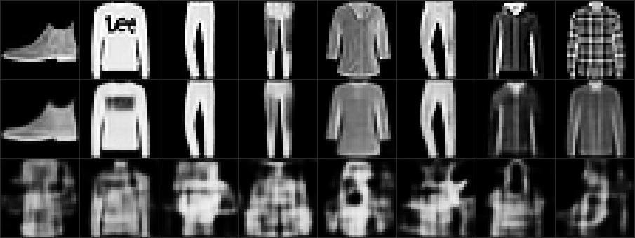

# Latent Radio

### ▶ Try it live (runs in your browser, no server): **https://suncal.github.io/latent-radio/**

A working demo of **AI-native (semantic) communication**: a neural *transmitter* and *receiver*,
trained together as one shared model, that send an image through a noisy channel by transmitting
*meaning* rather than bits. Because both ends share the model, the picture survives noise that
wrecks a classical digital link — and it degrades **gracefully** instead of falling off the digital
"cliff".

In the live demo you can pick a sample or **draw your own** image, drag the channel-noise (SNR)
slider, and watch Latent Radio reconstruct it next to a classical digital baseline. A toggle lets
you swap in a **mismatched receiver** to see the whole thing break — the key caveat of this idea.



## The idea

Every wireless system today **separates** two jobs: compress the image to bits (source coding),
then protect those bits with error-correction (channel coding). Shannon proved that split is
optimal — but only in the infinite-blocklength limit. For a real image over a real channel, a
single network trained to do **both jobs at once** (joint source-channel coding) can beat it, and
crucially it fails gracefully.

**Mechanism.** The encoder maps a 28×28 image to `k=128` power-normalized real channel symbols;
AWGN is added at a chosen SNR; the decoder reconstructs the image. Encoder + decoder are trained
end-to-end, SNR-adaptive (random SNR per batch), so one model handles all channel conditions. The
enc/dec pair **is** the shared model.

**Baseline.** A deliberately generous classical "separation" system: 2-D DCT transform coding +
ideal entropy coding, allowed to transmit up to the Shannon capacity `k·0.5·log₂(1+SNR)` bits —
perfect above threshold, outage below (the cliff).

## Measured results

| channel | Latent Radio | classical digital |
|--------:|:------------:|:-----------------:|
| −6 dB (bad)  | **15.4 dB** | 10.7 dB (blank — outage) |
| +14 dB (good)| **22.9 dB** | 20.3 dB |

Latent Radio wins at **every** SNR, and the gap widens as the channel worsens. See
[`report.html`](report.html) for the full curves and image montages.

## Honest failure modes (also in the live demo)

1. **Both ends must share the exact same model.** Pair an encoder with a decoder from a separately
   trained run — each excellent alone — and the link outputs garbage at *every* SNR, even a perfect
   channel. There is no interoperability standard here; the "protocol" is the shared weights.
   
2. **It leans on the source distribution.** Trained on clothing, it reconstructs handwritten digits
   noticeably worse. The shared model bakes in priors about what it expects to see.

## What this is / isn't

**Is:** a real, reproducible demonstration that a shared learned model transmits images over a noisy
channel more robustly than the classical separation architecture, with graceful degradation — plus
an honest accounting of the failure modes. **Isn't:** new spectrum or new physics. It's a new
*abstraction layer* — the same kind of move radio and the internet were. One bandwidth (k=128), one
dataset (Fashion-MNIST), small models.

## Reproduce

```bash
python3 train.py 0 && python3 train.py 1   # train two transceivers (MPS/CPU, a few min)
python3 evaluate.py                         # curves + montages -> results.json, recon.png, desync.png
python3 make_report.py                       # -> report.html
python3 export_onnx.py                        # -> web/ ONNX models for the browser demo
```

The browser app (`index.html` + `*.onnx` + `gallery.json`) is served at the repo root via GitHub
Pages and runs the exported models client-side with ONNX Runtime Web.

## Files

- `model.py` — encoder/decoder transceiver + PSNR. `channel.py` — power norm + AWGN + capacity.
- `digital.py` — the classical DCT baseline. `data.py` — Fashion-MNIST loader.
- `train.py` / `evaluate.py` / `make_report.py` / `export_onnx.py` — the pipeline.
- `index.html` — the live browser demo (self-contained, one file).

Built as an exploration of "what's a genuinely new communication idea?" — the answer being a new
layer (AI-native comms), not new physics.
